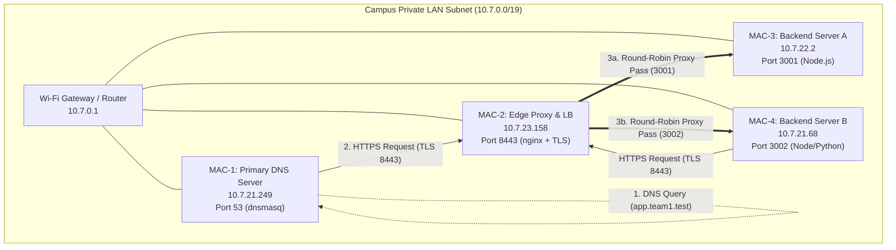
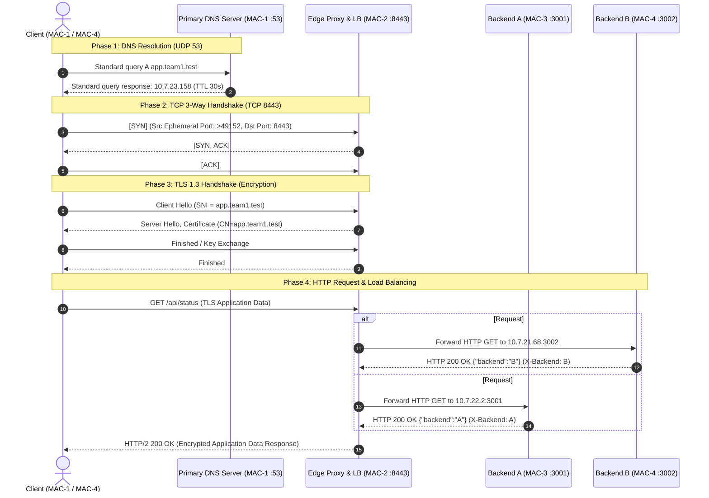

# Master Architecture Document — Computer Networks Course Project
## Private Network Service Platform (Team 1 — Phase 1 & Phase 2)

---

## 1. System Overview & Machine Inventory Table

| Machine Folder | Hardware Role | LAN IPv4 | Bound Ports | Core Software | Cloud Equivalent |
|---|---|---|---|---|---|
| **`MAC-1`** | Primary DNS Server & Client | `10.7.21.249` | `53/UDP`, `53/TCP` | `dnsmasq` v2.90, `dig`, `curl` | AWS Route 53 / CoreDNS |
| **`MAC-2`** | Edge Reverse Proxy & Load Balancer | `10.7.23.158` | `8443/TCP`, `80/TCP` | `nginx` v1.31.6 + TLS 1.3 | AWS ALB / Cloudflare Edge |
| **`MAC-3`** | Backend Application Server A | `10.7.22.2` | `3001/TCP` | Node.js REST API (`server.js`) | AWS EC2 / Worker A |
| **`MAC-4`** | Backend Server B + Test Client | `10.7.21.68` | `3002/TCP` | Node / Python REST API (`server.js`) | AWS EC2 / Worker B |

- **Subnet Range**: `10.7.0.0/19` (Netmask: `255.255.224.0`)
- **Default Gateway**: `10.7.0.1`
- **Private Domain Namespace**: `app.team1.test`, `api.team1.test`, `team1.test`

---

## 2. End-to-End Network Topology

---

## 3. Protocol Request Flow (Sequence & Packet Evidence)

---

## 4. OSI & TCP/IP Layer Mapping

| Layer # | OSI Layer Name | TCP/IP Layer Name | Protocol / Component in Project | Evidence Verification |
|---|---|---|---|---|
| **7** | Application | Application | DNS (`dnsmasq`), HTTP/1.1, HTTP/2, REST APIs | `dig`, `curl -kv`, query logs |
| **6** | Presentation | Application / TLS | TLS 1.3 (OpenSSL, Nginx cert termination) | Certificate `CN=app.team1.test` |
| **5** | Session | Application / TLS | TLS Session Keys & Connection Management | Wireshark `Client Hello (SNI)` |
| **4** | Transport | Transport | TCP (8443, 3001, 3002), UDP (53) | Wireshark `tcp.flags.syn == 1` |
| **3** | Network | Internet | IPv4 Packets, Subnet Routing (`10.7.0.0/19`) | `ping -c 3`, `netstat -rn` |
| **2** | Data Link | Network Access | Ethernet / Wi-Fi Frames (MAC Addresses) | `ifconfig en0`, Wireshark Frames |
| **1** | Physical | Network Access | Wi-Fi Signal / Physical Radio Transmission | Physical Campus AP |
