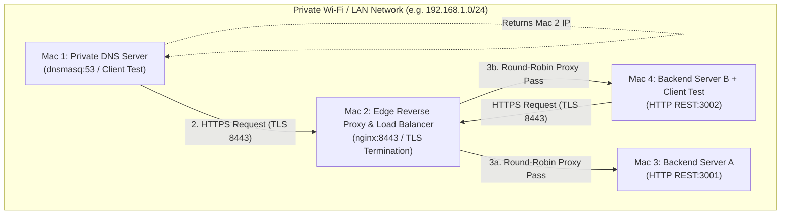

# Computer Networks Project - Architecture Document
## Phase 1: Local Network Private Service Platform
**Machine Role: Mac 2 (Edge Reverse Proxy & Load Balancer)**

---

## 1. Network Topology Diagram

---

## 2. Machine Roles & IP / Service Inventory Table

| Machine Identifier | Physical Hardware | Primary Network Role | Software / Services Running | Bound Ports | Cloud Architecture Equivalent |
|-------------------|-------------------|---------------------|-----------------------------|-------------|------------------------------|
| **Mac 1** | macOS Laptop | Private DNS Server & Test Client | `dnsmasq`, `dig`, `curl`, browser | 53/UDP, 53/TCP | AWS Route 53 / CoreDNS |
| **Mac 2 (This Machine)** | macOS Laptop | Edge Reverse Proxy & Load Balancer | `nginx`, TLS certificate, OpenSSL | 8080/HTTP, 8443/HTTPS | AWS Application Load Balancer (ALB) / Cloudflare Edge |
| **Mac 3** | macOS Laptop | Backend Application Server A | Python REST Service (`backend_a.py`) | 3001/TCP | AWS EC2 / Container Instance A |
| **Mac 4** | macOS Laptop | Backend Application Server B & Test Client | Python REST Service (`backend_b.py`), `curl` | 3002/TCP | AWS EC2 / Container Instance B |

---

## 3. End-to-End Request Flow & Layer Mapping

When a client on Mac 1 or Mac 4 types `https://app.team1.test:8443/api/status`:

1. **DNS Layer (Application Layer / UDP Port 53)**:
   - Client queries Mac 1 (`dnsmasq`) for `app.team1.test`.
   - Mac 1 responds with Mac 2's private IPv4 address.
2. **TCP Layer (Transport Layer / TCP Port 8443)**:
   - Client initiates 3-way handshake (`SYN` -> `SYN-ACK` -> `ACK`) with Mac 2.
3. **TLS Layer (Session / Presentation Layer)**:
   - Client & Mac 2 execute TLS 1.2/1.3 handshake (`ClientHello` -> `ServerHello` -> `Certificate` -> `Key Exchange`).
   - TLS is terminated at Mac 2 (Nginx).
4. **HTTP & Reverse Proxy Layer (Application Layer)**:
   - Client sends HTTP GET `/api/status`.
   - Mac 2 (Nginx) selects upstream backend using Round-Robin (`127.0.0.1:3001` or `127.0.0.1:3002`).
5. **Backend Processing & Response Header Ingress**:
   - Backend A or B processes request and attaches header `X-Backend: A` or `X-Backend: B`.
   - Response flows back through Nginx to Client.

---

## 4. OSI vs. TCP/IP Model Mapping Table

| Layer # | OSI Layer Name | TCP/IP Layer Name | Protocol / Component in Project |
|---------|----------------|-------------------|----------------------------------|
| 7 | Application | Application | DNS (dnsmasq), HTTP/1.1, HTTP/2, REST APIs |
| 6 | Presentation | Application / TLS | TLS 1.2 / TLS 1.3 (OpenSSL, Nginx certificate termination) |
| 5 | Session | Application / TLS | TLS Session Keys & Connection Management |
| 4 | Transport | Transport | TCP (Port 8443, 3001, 3002), UDP (Port 53) |
| 3 | Network | Internet | IP (IPv4 Packets, Subnet Routing, Default Gateways) |
| 2 | Data Link | Network Access | Ethernet / Wi-Fi Frames (MAC Addresses) |
| 1 | Physical | Network Access | Wi-Fi Signal / Physical Cables |
