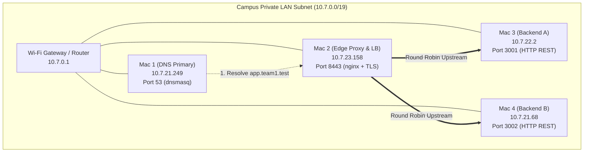
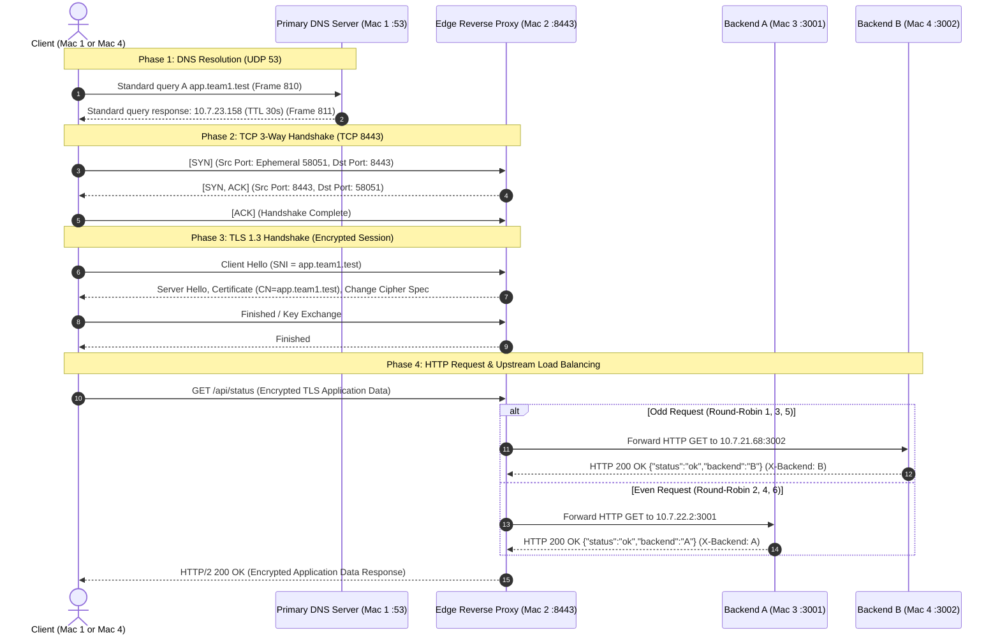

# Architecture Document — Private Network Service Platform
## Computer Networks Course Project (Phase 1 & Phase 2)
### Team 1 Architecture & Network Topology

---

## 1. Network Inventory & Machine Roles

| Machine | Role | Hostname / User | LAN IPv4 | Bound Ports | Service / Process | Cloud Equivalent |
|---|---|---|---|---|---|---|
| **Mac 1** | Primary DNS Server + Test Client | `ankitnst35027` | `10.7.21.249` | `53/UDP`, `53/TCP` | `dnsmasq` v2.90 | AWS Route 53 / CoreDNS |
| **Mac 2** | Edge Reverse Proxy & Load Balancer | `kchhillar13` | `10.7.23.158` | `8443/TCP`, `80/TCP` | `nginx` v1.31.6 + TLS 1.3 | AWS ALB / Cloudflare Edge |
| **Mac 3** | Backend Server A | `Kinshu` | `10.7.22.2` | `3001/TCP` | Node.js REST API | EC2 Instance A |
| **Mac 4** | Backend Server B + Secondary Client | Team Member | `10.7.21.68` | `3002/TCP` | Python / Node.js REST API | EC2 Instance B |

- **Subnet Prefix**: `10.7.0.0/19` (Netmask: `255.255.224.0`)
- **Default Gateway / Router**: `10.7.0.1`
- **Private Domain**: `app.team1.test`, `api.team1.test`, `team1.test`
- **Active Network Interface**: `en0` (Wi-Fi)

---

## 2. Physical & Logical Network Topology

---

## 3. End-to-End Protocol Request Flow

When a client requests `https://app.team1.test:8443/api/status`:

---

## 4. OSI & TCP/IP Layer Mapping

| Layer (OSI) | Protocol | Role in Project | Verification Tool & Evidence |
|---|---|---|---|
| **Application (L7)** | DNS, HTTP/2, REST | Resolves domain, handles JSON API requests | `dig`, `curl -kv`, `tail /tmp/dnsmasq_primary.log` |
| **Presentation (L6)** | TLS 1.3 | Encrypts payload, verifies X.509 server certificate | OpenSSL, Wireshark `tls.handshake` filter |
| **Session (L5)** | TLS Session | Maintains secure session keys & SNI handshake | Wireshark Frame `Client Hello (SNI=app.team1.test)` |
| **Transport (L4)** | TCP / UDP | UDP 53 for DNS; TCP 8443 for HTTPS; TCP 3001/3002 for upstream | Wireshark `tcp.flags.syn == 1`, ephemeral ports |
| **Network (L3)** | IPv4, ICMP | Routes packets across `10.7.0.0/19` subnet | `ping -c 3`, `netstat -rn -f inet` |
| **Data Link (L2)** | Ethernet / 802.11 | MAC address framing on `en0` Wi-Fi adapter | `ifconfig en0`, Wireshark Ethernet frames |
| **Physical (L1)** | Wi-Fi / Radio | Physical wireless signal communication | Campus Access Point connection |

---

## 5. Security & Isolation Model

- **Internal Domain Only**: `.test` reserved TLD prevents external DNS collision and avoids macOS `.local` mDNS conflicts.
- **TLS Termination**: All client-facing traffic is secured via TLS 1.3 with AES-GCM / ChaCha20-Poly1305 ciphers.
- **Backend Protection**: Backends (Mac 3 and Mac 4) are abstract application workers; clients only communicate with the Edge IP (`10.7.23.158`).
